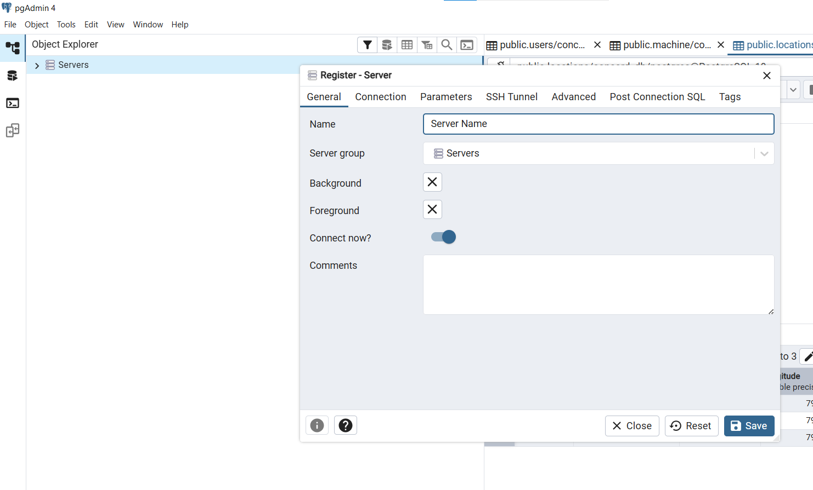
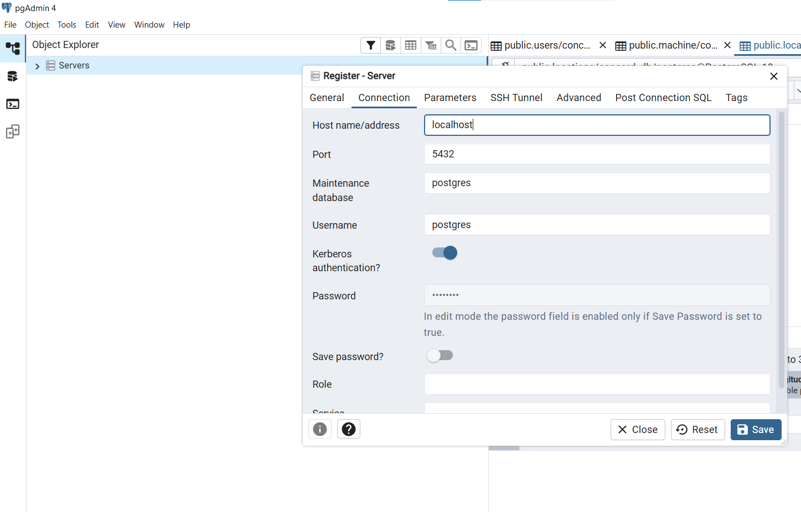
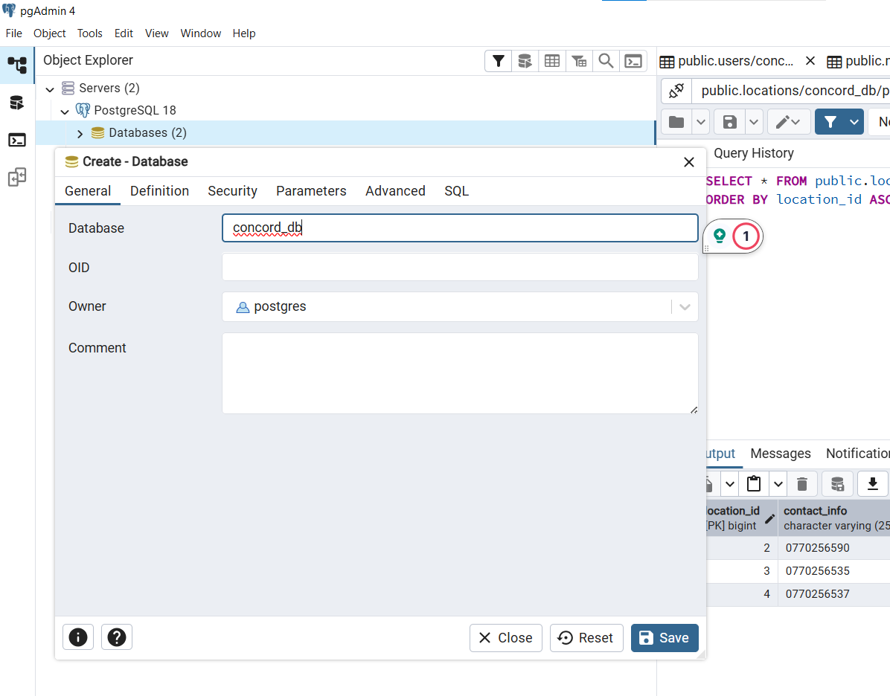
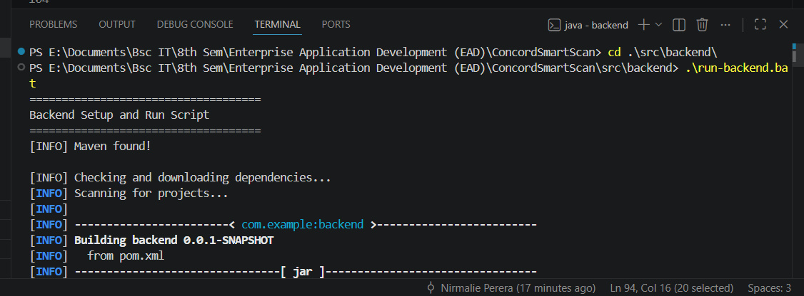
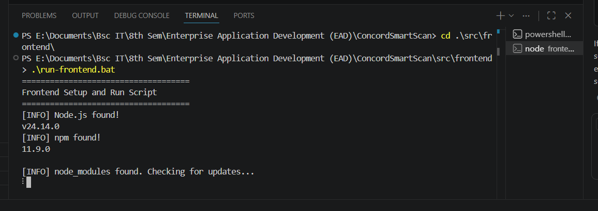
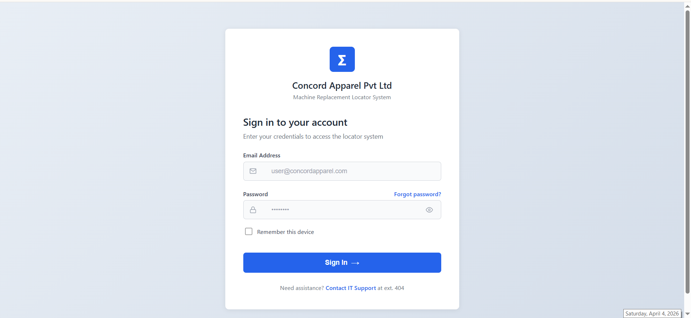

# ConcordSmartScan

> Enterprise Application Development - Group B
> Automating Asset Recovery and Allocation for the Garment Industry

## Project Overview
ConcordSmartScan is an enterprise solution designed to reduce production downtime in garment factories.

When a sewing machine fails, finding a replacement manually across multiple stores can delay production. This system improves that process by helping teams identify and allocate available machines faster.

## Project Resources
- **ConcordSmartScan Final Presentation**: [docs/ConcordSmartScan final presentation.pptx](docs/ConcordSmartScan%20final%20presentation.pptx)
- **ConcordSmartScan Wireframes**: [Figma Link](https://www.figma.com/design/Wz0zwspewrJ3hwQs6MwX02/CONCORD-APPAREL-PVT-LTD---EDB?node-id=0-1&t=fnRMTY4CM12PtjgT-1)

## Project Structure

```text
ConcordSmartScan/
|-- src/
|   |-- backend/   # Spring Boot API
|   `-- frontend/  # React application
|-- docker-compose.yml
`-- README.md
```

## Run with Docker (recommended)

From the project root:

```powershell
docker compose up --build
```

To include pgAdmin (optional):

```powershell
docker compose --profile tools up --build
```

Access:

- Frontend: http://localhost:3000
- Backend: http://localhost:8080
- pgAdmin (optional): http://localhost:5050

pgAdmin connection details (inside Docker):

- Host: db
- Port: 5432
- Database: concord_db
- Username: postgres
- Password: postgres

Stop services:

```powershell
docker compose down
```

To remove volumes and reset data:

```powershell
docker compose down -v
```

Local overrides: this repo includes docker-compose.override.yml which is auto-loaded by Docker Compose. It maps host ports to 3001/8081/5433/5051 and updates the frontend API URL to http://localhost:8081.

Migrations:

- Flyway is enabled to track migrations (baseline only for now; schema is still created by Hibernate).

## Setup and Run Project

### 1. Clone the project from dev branch

```powershell
git clone -b dev <repository-url>
cd ConcordSmartScan
```

If you already cloned the repository and need to switch:

```powershell
git checkout dev
git pull origin dev
```

### 2. Prerequisites

Only needed if you are running without Docker.

Before starting setup, make sure these are already installed on your machine:

- Java 17+
- Maven 3.8+
- Node.js 18+ and npm
- PostgreSQL
- pgAdmin 4

### 3. Set up PostgreSQL and pgAdmin

Skip this section if you are using Docker with the pgAdmin profile.

Backend database config is in src/backend/src/main/resources/application.properties and expects:

- Host: localhost
- Port: 5432
- Database: concord_db
- Username: postgres
- Password: postgres

Add the PostgreSQL server in pgAdmin:

1. Open pgAdmin.
2. In Object Explorer, right-click Servers and select Register > Server.
3. In General tab, enter any server name.
4. In Connection tab, use Host: localhost, Port: 5432, Username: postgres, Password: postgres.
5. Save the server.




Create the project database in pgAdmin:

1. Expand your registered server.
2. Right-click Databases and select Create > Database.
3. Set Database name to concord_db.
4. Keep Owner as postgres, then save.



Before running the backend, ensure the PostgreSQL service is running, and credentials match the values above.

Reference (pgAdmin and database connection):
https://youtu.be/WFT5MaZN6g4?si=1bB8h45fQ8TcCKwr

### 4. Run backend and frontend in two terminals

Open two terminal windows.

Terminal 1 (Backend):

```powershell
cd src/backend
run-backend.bat
```



Terminal 2 (Frontend):

```powershell
cd src/frontend
run-frontend.bat
```



### 5. Access the application

- Frontend: http://localhost:3000 (will open in browser once the project is up and running)
- Backend: http://localhost:8080 (for testing APIs if needed)

First page shown on opening the frontend:



Do not close the terminals while the project is running. 
To top running use below, in each terminal: 

```powershell
ctrl+c
``` 

Check if tables are created in pgAdmin at:

Server > Your_Server_Name > Databases > concord_db > Schemas > Public > Tables

Check if Admin details are in user table:

Right Click users -> View/Edit Data -> All Rows 

Seed Admin login details are initialized in:

src/backend/src/main/java/com/example/backend/config/DataInitializer.java

Default seed Admin credentials:

- Email: admin@concord.com
- Password: Admin@123

## Technologies Used

### Frontend
- React
- Axios
- Node.js

### Backend
- Spring Boot
- Java
- Maven
- Spring Data JPA

### Database and Management
- PostgreSQL
- pgAdmin 4

